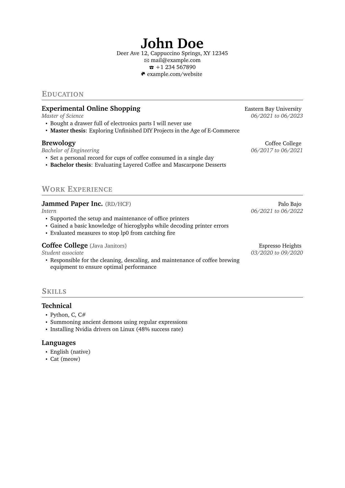

# resume-template

This repo contains a LaTeX template that can be used to create a single-page resume with zero bloat.

To customize the template, only the files in the `data` folder need to be touched:

- The settings of the template can be adjusted in `data/settings.tex`. 
- The contents of the resume can be adjusted in `data/sections.tex`. Much of the formatting is performed with the `resumeList` environment, which takes five arguments. See the provided example for more info.

The output file looks like this:

When compiling with XeTeX, the file size is around 20KB.

## References

The Latex template has been inspired by / derived from the following sources:

- [Make a Resume in LaTeX!](https://www.drshika.com/2022/04/15/LaTeX-Resumes) by Drshika Asher
- [latex-rechnung](https://github.com/d-koppenhagen/latex-rechnung) by d-koppenhagen
- [Résumés | Butterick's Practical Typography](https://practicaltypography.com/resumes.html) by Matthew Butterick
